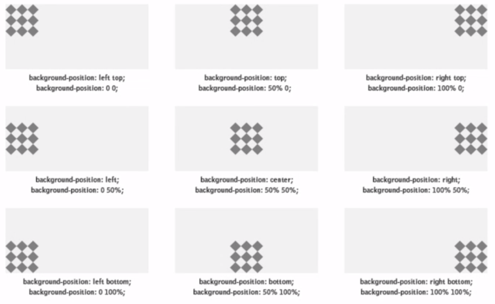

# Module 2

## Color

1. Named Color
2. RGB
3. RGB alpha (1 for on, 0 for off)
4. Hex etc.

## Measuring Unit

### Absolute Lengths (fixed unit)
1. cm (we will not use it)
2. px (we will use it sometimes)

### Relative Lengths
1. % - Reletive to the parent element
2. em - Relative to the font-size of the element (not common today)
3. rem - Relative to the font size of root element

## Font
``` css
    font-size: ;
    font-weight: ;
    font-family: ;
    text-align: ;
    text-decoration: underline wavy green;
```

## Selector (ID vs Class)
    Tag based =>
        1. To apply on a specific category
        2. p{} => tag selector
        3. style-rule: style-value;
    ID => 
        1. To apply on a specific content
        2. <p id="id1"> </p>
        3. (to apply style on any id use #)
    Class =>
        1. To apply on a group of content
        2. <p class="cls1"> </p>
        3. (to apply style on any id use .{dot}) 
    Universal =>
        1. Used rarely
        2. used style reseter
        3. (to apply style use *{style-rule:style-value;})
    
## Mixed Selector

### Span
- To impose style on a specific part of taged content

### div
- To impose style on multiple targed content
 To select multiple tag
``` css
    p, h3{
            style-rule: style-value;
        }
```
- Select those 'green' classes who are under li
``` css
    li.green{
            style-rule: style-value;
        }
```
- Select those 'li' and under 'ul'
``` css
    ul li{
        color: purple;
    }
```
- Attribute selector
``` css
    input[type="text"]{
        background-color: #fff;
        width: 100px;
    }
```
## Border

Border shorthand 

``` css
   border: borderWidth_borderStyle_borderColor;
```
or
``` css
    borderWidth: ;
    borderStyle: ;
    borderColor: ;
```
``` css
border-radious: 20px;
```
``` css
border-left: borderWidth_borderStyle_borderColor;
```

## Margin
Gap between two contentes
``` css
    margin-left: 20px;
```
- one value - all four sides
- two values - top and bottom | right and left
- three values - top | right and left | bottom
- four values - top | right | left | bottom
## Padding
``` css
 padding-left: 20px;
```
- one value - all four sides
- two values - top and bottom | right and left
- three values - top | right and left | bottom
- four values - top | right | left | bottom 

## Box-Model
1. content
2. padding
3. border
4. margin
5. height-width

## Ways to apply css
1. Inline style
    - Uses: style override, better performance
2. Internal(embaded) styles
    - Problem: Can't share between multiple html files
3. External styles
    - Folder name: css/styles
        <link rel="stylesheet" href="styles/blog.css">

## Image
``` css
    background-image: url('../images/strong.jpg');
    background-size: 5%|cover|content;
    background-repeat: no-repeat|repeat-x|repeat-y;
    background-position: top right;
```

## Inline, block, inline-block

## Box Shadow